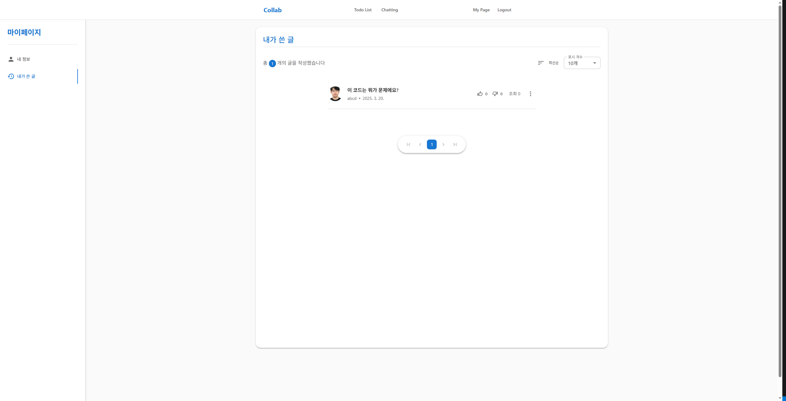

# Collab - 사내 협업 서비스 시스템

## 1. 프로젝트 소개
Collab은 사내 협업을 위한 웹 애플리케이션으로, 팀원들이 원활하게 소통하고 업무를 효율적으로 관리할 수 있도록 다양한 기능을 제공합니다. 게시판, 업무 리스트, 실시간 채팅 기능을 포함하여 팀워크를 강화하고 생산성을 향상시키는 것을 목표로 합니다.

## 2. 기획 배경
사내에서 효과적인 커뮤니케이션과 업무 관리를 위해 여러 도구를 혼용하다 보면 협업이 오히려 비효율적으로 이루어지는 경우가 많습니다. 이에 따라 하나의 플랫폼에서 업무를 통합 관리할 수 있는 협업 시스템이 필요하다고 판단하여 Collab을 기획하게 되었습니다.

## 3. 프로젝트 목표
1. 효율적인 협업 환경 제공
- 게시판, 업무 리스트, 실시간 채팅 기능을 통합하여 원활한 커뮤니케이션 및 협업 지원
- 코드 및 이미지 첨부 기능을 제공하여 개발자 및 기획자의 협업을 더욱 원활하게 함

2. 사용자 친화적인 UI/UX 구현
- MUI를 활용하여 직관적이고 반응형 UI 구성
- React-Quill을 이용한 편리한 게시글 작성 기능 제공

3. 안정적인 시스템 설계 및 확장성 고려
- Spring Boot 기반의 RESTful API 설계 및 보안 강화(Spring Security, JWT)
- AWS S3를 활용한 이미지 업로드 및 저장소 관리

4. 실시간 커뮤니케이션 기능 강화
- WebSocket을 활용한 실시간 채팅 시스템 구축

5. 업무 관리 기능 강화
- 다양한 필터 옵션(부서별, 기한별, 상태별) 적용하여 업무 진행 사항을 쉽게 파악할 수 있도록 함

## 4. 서비스 소개
- **게시판**: 코드 및 이미지 첨부 가능, 댓글 및 대댓글 기능 지원.
- **업무 리스트 (Todo List)**: 필터 기능 적용, 부서별, 기한별, 상태별 등 업무 진행 여부를 관리할 수 있음.
- **실시간 채팅**: WebSocket을 이용한 실시간 채팅 기능으로 빠른 의사결정과 협업 지원.

## 5. 서비스 대상
- 사내에서 협업 및 업무 관리를 체계적으로 하고 싶은 기업 및 팀
- 프로젝트 및 태스크 관리를 쉽고 직관적으로 하고 싶은 개발자 및 기획자
- 업무 진행 사항을 공유하고 소통이 필요한 모든 직군의 팀원

## 6. 서비스 화면 및 기능 소개
### 1) 프로필 사진 변경
- 사용자 프로필 사진을 변경할 수 있는 기능
    - AWS S3를 이용하여 이미지 파일 저장
- 본인이 작성한 게시글 모아보기 기능




### 2) 게시판
- 코드 및 이미지 첨부 가능
- 좋아요/싫어요 기능
- 댓글 및 대댓글 지원


### 3) 업무 리스트 (Todo List)
- 다양한 필터 적용 가능 (부서별, 기한별, 상태별 등)


### 4) 실시간 채팅
- 부서별 필터링 된 인원 추가
- WebSocket을 이용한 실시간 채팅 기능
- 빠른 의사결정 및 협업 지원


## 7. 사용된 기술 스택

### 프론트엔드 (FE)
- React.js
- React Router
- JavaScript
- MUI
- AWS S3
- React-Quill
- Zustand

### 백엔드 (BE)
- Spring Boot 3.2.6
- Spring Security
- Java

### 데이터베이스 (DB)
- MySQL 9.0.1

## 8. 프로젝트 구조
- FE
```
└─📦 src
  ├─📂 api                # API 통신 관련 파일들
  ├─📂 assets             # 정적 데이터 (이미지, 폰트, 아이콘 등)
  │  ├─📂 images          # 이미지 파일들
  ├─📂 aws                # AWS 관련 설정 및 서비스 코드
  ├─📂 components         # 재사용 가능한 UI 컴포넌트
  │  ├─📂 article         # 게시글 관련 컴포넌트
  │  ├─📂 chat            # 채팅 관련 컴포넌트
  │  ├─📂 myPage          # 마이 페이지 관련 컴포넌트
  ├─📂 pages              # 각 페이지 컴포넌트
  ├─📂 redux              # 상태 관리
  │  ├─📂 store           # zustand 및 액션, 리듀서
  ├─📂 utils              # 유틸리티 함수
  └─📜 App.jsx            # 애플리케이션 진입점 (루트 컴포넌트)

```
- BE
```
└─📦 collab              # 프로젝트 루트 디렉토리
  ├─📂 chatting          # 채팅 관련 로직 (채팅 메시지 처리, 채팅방 관리 등)
  ├─📂 config            # 전역 설정 파일 (보안 설정, CORS 설정, DB 설정 등)
  ├─📂 controller        # 요청을 처리하는 컨트롤러 (API 엔드포인트 정의)
  ├─📂 dto               # 데이터 전송 객체 (클라이언트와 서버 간 데이터 전달용 클래스)
  ├─📂 entity            # JPA 엔티티 (데이터베이스 테이블과 매핑되는 클래스)
  ├─📂 exception         # 예외 처리 관련 클래스 (커스텀 예외 정의 및 예외 핸들러)
  ├─📂 repository        # 데이터베이스 접근 계층 (JPA Repository 인터페이스)
  ├─📂 service           # 비즈니스 로직을 처리하는 서비스 계층
  ├─📂 vo                # 값 객체 (불변 객체, 특정 연산을 위한 값 저장용 클래스)
  └─📂 websocket         # WebSocket 관련 로직 (실시간 채팅 기능 구현)
```
## 9. ERD (Entity Relationship Diagram)


## 10. API 명세서

